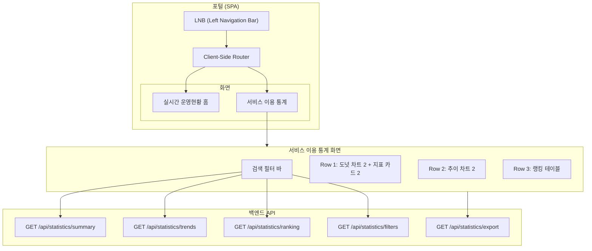
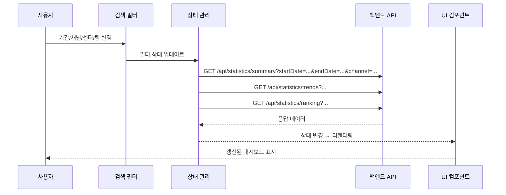

# 설계 문서: 서비스 이용 통계 (Service Statistics)

## 개요 (Overview)

서비스 이용 통계 화면은 콜센터 운영 포털 내에서 일별(Daily) 마감 데이터를 기반으로 기간별 운영 성과 추이와 서비스 이용 현황을 분석하는 대시보드 화면이다. 기존 실시간 운영현황 홈 화면과 동일한 포털 셸(LNB + 콘텐츠 영역) 안에서 클라이언트 사이드 라우팅으로 전환되며, 센터 관리자·운영 팀장·데이터 분석가가 주요 사용자이다.

핵심 기능:
- 기간(DatePicker) + 조직(채널/센터/팀) 필터를 통한 조건부 데이터 조회
- 종합 지표 카드(평균 상담시간, 총 상담 콜 수) 및 도넛 차트(어드바이저 이용률, 지식검색 활용률)
- 시계열 추이 차트(운영 효율, 시스템 활용도)
- AI 추천 상담코드 TOP 10 랭킹 테이블
- 엑셀 다운로드

설계 결정 근거:
- 실시간 운영현황 홈과 동일한 포털 셸을 공유하여 LNB 기반 SPA 라우팅으로 화면 전환 → 페이지 새로고침 없이 빠른 전환
- 일별 마감 데이터 기반이므로 WebSocket이 아닌 REST API 호출 방식 채택
- 필터 변경 시 전체 데이터 자동 갱신 → 별도 "검색" 버튼 없이 즉시 반영

---

## 아키텍처 (Architecture)

### 전체 구조



### 라우팅 구조

| 경로 | 화면 | 설명 |
|------|------|------|
| `/` | 실시간 운영현황 홈 | 기본 랜딩 페이지 |
| `/statistics` | 서비스 이용 통계 | 기간별 통계 대시보드 |

LNB는 포털 셸 레벨에서 렌더링되며, 현재 활성 경로에 따라 메뉴 항목의 활성 상태를 시각적으로 표시한다.

### 데이터 흐름



---

## 컴포넌트 및 인터페이스 (Components and Interfaces)

### 페이지 레이아웃 구조

```
┌─────────────────────────────────────────────────────────┐
│ LNB │              콘텐츠 영역 (1152px)                  │
│     │ ┌─────────────────────────────────────────────┐   │
│     │ │ [DatePicker 280px] [채널] [센터] [팀] [Excel]│   │
│     │ └─────────────────────────────────────────────┘   │
│     │ ┌──────────┬──────────┬────────────────────────┐  │
│     │ │ 도넛차트  │ 도넛차트  │  평균 상담시간 카드    │  │
│     │ │ 어드바이저│ 지식검색  │  ──────────────────    │  │
│     │ │ 332px    │ 332px    │  총 상담 콜 수 카드    │  │
│     │ │          │          │  456px                 │  │
│     │ └──────────┴──────────┴────────────────────────┘  │
│     │ ┌────────────────────┬────────────────────┐       │
│     │ │ 운영 효율 추이 차트  │ 시스템 활용도 추이   │       │
│     │ │ 568px              │ 568px              │       │
│     │ └────────────────────┴────────────────────┘       │
│     │ ┌─────────────────────────────────────────┐       │
│     │ │ AI 추천 상담코드 TOP 10 (1152px, 좌우분할) │       │
│     │ └─────────────────────────────────────────┘       │
└─────────────────────────────────────────────────────────┘
```

### 컴포넌트 계층

```
ServiceStatisticsPage
├── SearchFilterBar
│   ├── DateRangePicker (280px × 32px)
│   ├── ChannelFilter (체크박스: 전체/홈/모바일)
│   ├── CenterFilter (채널 종속)
│   ├── TeamFilter (센터 종속)
│   └── ExcelDownloadButton
├── SummaryRow (Row 1)
│   ├── DonutChartCard (어드바이저 이용률, 332px)
│   │   ├── DonutChart (212×212)
│   │   ├── ChartLegend
│   │   └── HelpTooltip
│   ├── DonutChartCard (지식검색 활용률, 332px)
│   │   ├── DonutChart (212×212)
│   │   ├── ChartLegend
│   │   └── HelpTooltip
│   └── SummaryCardStack (456px, 세로 배치)
│       ├── SummaryCard (평균 상담시간)
│       │   ├── MetricValue (24px bold)
│       │   ├── PeriodComparison (상승: #EF4444, 하락: #3B82F6)
│       │   └── HelpTooltip
│       └── SummaryCard (총 상담 콜 수)
│           ├── MetricValue (24px bold)
│           ├── PeriodComparison
│           └── HelpTooltip
├── TrendRow (Row 2)
│   ├── TrendChartCard (운영 효율 추이, 568px)
│   │   ├── DualAxisLineChart (좌Y: 콜 수, 우Y: 상담시간)
│   │   └── ChartTooltip
│   └── TrendChartCard (시스템 활용도 추이, 568px)
│       ├── SingleAxisLineChart (Y: 백분율)
│       ├── ChartLegend (8×8 사각형 + 텍스트)
│       └── ChartTooltip
└── RankingRow (Row 3)
    └── RankingTableCard (1152px, 좌우 분할)
        ├── RankingTable (AI 추천 상담코드 TOP 10)
        │   ├── TableHeader (40px)
        │   └── TableBody (48px per row)
        └── HelpTooltip
```

### 주요 컴포넌트 인터페이스

#### SearchFilterBar

```typescript
interface FilterState {
  startDate: string;       // ISO 8601 (YYYY-MM-DD)
  endDate: string;         // ISO 8601 (YYYY-MM-DD)
  channels: string[];      // ["all"] | ["home"] | ["mobile"] | ["home","mobile"]
  centerId: string | null;
  teamId: string | null;
}

interface SearchFilterBarProps {
  initialFilter: FilterState;
  onFilterChange: (filter: FilterState) => void;
  onExcelDownload: () => void;
}
```

#### SummaryCard

```typescript
interface SummaryCardProps {
  title: string;
  value: number;
  unit: string;                    // "초", "건" 등
  previousValue: number | null;    // 전기 값 (변화량 계산용)
  tooltipText: string;
  formatValue?: (v: number) => string;
}
```

#### DonutChartCard

```typescript
interface DonutChartCardProps {
  title: string;
  percentage: number;              // 중앙 표시 백분율
  outerRingLabel: string;          // "총 활성 좌석수 {n} 석"
  outerRingValue: number;
  innerRingLabel: string;          // "총 앱 접속자수 {n} 명"
  innerRingValue: number;
  tooltipText: string;
}
```

#### TrendChartCard

```typescript
interface TrendDataPoint {
  date: string;                    // YYYY-MM-DD
  [key: string]: number | string;
}

interface TrendChartCardProps {
  title: string;
  data: TrendDataPoint[];
  lines: LineConfig[];
  width: number;                   // 568
  dualAxis?: boolean;              // 운영 효율 차트: true
}

interface LineConfig {
  dataKey: string;
  label: string;
  color: string;
  yAxisId?: "left" | "right";
}
```

#### RankingTable

```typescript
interface RankingItem {
  rank: number;
  categoryName: string;            // 상담 소카테고리명
  codeNumber: string;              // 코드 번호
  recommendCount: number;          // 추천 횟수
  growthRate: number;              // AI 추천 증가율 (%)
}

interface RankingTableProps {
  items: RankingItem[];
  tooltipText: string;
}
```

### API 인터페이스

#### GET /api/statistics/summary

요청 파라미터:
```
startDate: string (YYYY-MM-DD)
endDate: string (YYYY-MM-DD)
channel?: string
centerId?: string
teamId?: string
```

응답:
```typescript
interface SummaryResponse {
  avgConsultationTime: number;         // 일평균 상담시간 (초)
  prevAvgConsultationTime: number;     // 전기 일평균 상담시간
  totalConsultationCalls: number;      // 총 상담 콜 수
  prevTotalConsultationCalls: number;  // 전기 총 상담 콜 수
  advisorUtilizationRate: number;      // 어드바이저 이용률 (%)
  totalActiveSeats: number;            // 총 활성 좌석수
  totalAppAccessors: number;           // 총 앱 접속자수
  knowledgeSearchRate: number;         // 지식검색 활용률 (%)
  totalRecommendedKnowledge: number;   // 총 추천 지식 수
  totalAnswerConfirmations: number;    // 총 답변 확인 수
}
```

#### GET /api/statistics/trends

응답:
```typescript
interface TrendResponse {
  operationalEfficiency: {
    date: string;
    consultationCalls: number;
    avgConsultationTime: number;
  }[];
  systemUtilization: {
    date: string;
    advisorUtilizationRate: number;
    knowledgeSearchRate: number;
  }[];
}
```

#### GET /api/statistics/ranking

응답:
```typescript
interface RankingResponse {
  items: RankingItem[];
}
```

#### GET /api/statistics/filters

응답:
```typescript
interface FiltersResponse {
  channels: { id: string; name: string }[];
  centers: { id: string; name: string; channelId: string }[];
  teams: { id: string; name: string; centerId: string }[];
}
```

#### GET /api/statistics/export

엑셀 파일(.xlsx) 바이너리 응답. Content-Type: `application/vnd.openxmlformats-officedocument.spreadsheetml.sheet`

---

## 데이터 모델 (Data Models)

### 필터 상태 모델

```typescript
interface FilterState {
  startDate: string;       // YYYY-MM-DD, 기본값: 7일 전
  endDate: string;         // YYYY-MM-DD, 기본값: 오늘
  channels: string[];      // 기본값: ["all"]
  centerId: string | null; // 기본값: null (전체)
  teamId: string | null;   // 기본값: null (전체)
}
```

### 전기(Previous Period) 계산 로직

```
조회 기간: startDate ~ endDate (N일)
전기: (startDate - N일) ~ (startDate - 1일)

예시: 조회 기간 2024-01-08 ~ 2024-01-14 (7일)
      전기: 2024-01-01 ~ 2024-01-07 (7일)
```

### 지표 계산 공식

| 지표 | 계산식 | 단위 |
|------|--------|------|
| 평균 상담시간 | Σ(일별 평균 상담시간) / 조회일수 | 초 |
| 총 상담 콜 수 | Σ(일별 상담 콜 수) | 건 |
| 어드바이저 이용률 | (이용 상담사 수 / 활성 상담석 수) × 100 | % |
| 지식검색 활용률 | (검색·클릭 수 / 추천 수) × 100 | % |
| AI 추천 증가율 | (종료 추천횟수 − 시작 추천횟수) / (시작 추천횟수 + 1) × 100 | % |

### 전기 대비 변화량 표시 규칙

| 조건 | 색상 | 아이콘 |
|------|------|--------|
| 현재 > 전기 (상승) | #EF4444 (빨간색) | ▲ |
| 현재 < 전기 (하락) | #3B82F6 (파란색) | ▼ |
| 현재 = 전기 (동일) | #64748B (보조 텍스트) | — |

### 엑셀 다운로드 데이터 구조

| 시트명 | 포함 데이터 |
|--------|------------|
| 종합 지표 요약 | 평균 상담시간, 총 상담 콜 수, 어드바이저 이용률, 지식검색 활용률, 전기 대비 변화량 |
| 일별 추이 데이터 | 날짜, 상담 콜 수, 평균 상담시간, 어드바이저 이용률, 지식검색 활용률 |
| 랭킹 테이블 | 순위, 소카테고리명, 코드 번호, 추천 횟수, AI 추천 증가율 |


---

## 정확성 속성 (Correctness Properties)

*속성(Property)이란 시스템의 모든 유효한 실행에서 참이어야 하는 특성 또는 동작을 의미한다. 속성은 사람이 읽을 수 있는 명세와 기계가 검증할 수 있는 정확성 보장 사이의 다리 역할을 한다.*

### Property 1: 기본 기간 계산 정확성

*임의의* 날짜를 "오늘"로 설정했을 때, 기본 기간 계산 함수는 시작일을 (오늘 - 6일), 종료일을 오늘로 반환해야 하며, 시작일과 종료일 사이의 일수는 항상 7일이어야 한다.

**검증 대상: 요구사항 2.3**

### Property 2: 종속 필터링 정확성

*임의의* 조직 데이터셋(채널, 센터, 팀)과 선택된 상위 필터 값에 대해, 하위 필터 결과는 선택된 상위 항목에 소속된 항목만 포함해야 한다. 즉, 채널 선택 시 반환되는 센터는 모두 해당 채널에 속하고, 센터 선택 시 반환되는 팀은 모두 해당 센터에 속해야 한다.

**검증 대상: 요구사항 3.3, 3.4**

### Property 3: 집계 지표 계산 정확성

*임의의* 일별 데이터 배열에 대해, 평균 집계 함수는 배열 원소의 합을 배열 길이로 나눈 값과 일치해야 하고, 합계 집계 함수는 배열 원소의 합과 일치해야 한다.

**검증 대상: 요구사항 4.1, 5.1**

### Property 4: 전기 대비 변화 방향 판단 정확성

*임의의* 두 수치(현재값, 전기값) 쌍에 대해, 변화 방향 판단 함수는 현재값 > 전기값이면 "상승"(#EF4444), 현재값 < 전기값이면 "하락"(#3B82F6), 현재값 = 전기값이면 "동일"(#64748B)을 반환해야 한다.

**검증 대상: 요구사항 4.2, 4.3, 5.2, 5.3**

### Property 5: 어드바이저 이용률 계산 정확성

*임의의* 양의 정수 쌍(이용 상담사 수, 활성 상담석 수)에 대해, 어드바이저 이용률 계산 함수는 (이용 상담사 수 / 활성 상담석 수) × 100과 일치해야 하며, 결과는 0 이상이어야 한다. 활성 상담석 수가 0인 경우 0%를 반환해야 한다.

**검증 대상: 요구사항 6.1**

### Property 6: 지식검색 활용률 계산 정확성

*임의의* 양의 정수 쌍(검색·클릭 수, 추천 수)에 대해, 지식검색 활용률 계산 함수는 (검색·클릭 수 / 추천 수) × 100과 일치해야 하며, 결과는 0 이상이어야 한다. 추천 수가 0인 경우 0%를 반환해야 한다.

**검증 대상: 요구사항 7.1**

### Property 7: 지표 레이블 포맷팅 정확성

*임의의* 양의 정수 n과 레이블 템플릿에 대해, 포맷팅 함수는 템플릿 내 `{n}` 플레이스홀더를 실제 숫자로 치환한 문자열을 반환해야 하며, 반환된 문자열에는 해당 숫자가 포함되어야 한다.

**검증 대상: 요구사항 6.3, 6.4, 7.3, 7.4**

### Property 8: TOP 10 랭킹 정렬 및 추출 정확성

*임의의* 상담코드 목록(10개 이상)에 대해, 랭킹 추출 함수는 AI 추천 증가율 기준 내림차순으로 정렬된 상위 10개 항목만 반환해야 하며, 반환된 목록의 길이는 min(입력 길이, 10)이고, 각 항목의 증가율은 다음 항목의 증가율 이상이어야 한다.

**검증 대상: 요구사항 10.1**

### Property 9: AI 추천 증가율 계산 및 포맷팅 정확성

*임의의* 양의 정수 쌍(시작 추천횟수, 종료 추천횟수)에 대해, AI 추천 증가율 계산 함수는 (종료 − 시작) / (시작 + 1) × 100과 일치해야 한다. 또한 결과가 양수이면 "+X.X%" 형식, 음수이면 "−X.X%" 형식으로 소수점 첫째 자리까지 포맷팅되어야 한다. 시작 추천횟수가 0인 경우에도 분모가 1이 되어 0으로 나누기가 발생하지 않아야 한다.

**검증 대상: 요구사항 10.4, 10.5, 10.6, 9.4**

---

## 오류 처리 (Error Handling)

### API 오류 처리 전략

| 오류 유형 | HTTP 상태 | 처리 방식 |
|-----------|-----------|-----------|
| 네트워크 오류 | - | 각 컴포넌트에 오류 메시지 + "재시도" 버튼 표시 |
| 서버 오류 | 5xx | "서버 오류가 발생했습니다. 잠시 후 다시 시도해주세요." + 재시도 버튼 |
| 인증 오류 | 401/403 | 로그인 페이지로 리다이렉트 |
| 잘못된 요청 | 400 | "요청 조건을 확인해주세요." 메시지 표시 |
| 데이터 없음 | 200 (빈 응답) | "데이터 없음" 안내 메시지 표시 |
| 요청 타임아웃 | 408 / timeout | "요청 시간이 초과되었습니다." + 재시도 버튼 |

### 컴포넌트별 오류 상태

각 컴포넌트(Summary Card, Donut Chart, Trend Chart, Ranking Table)는 독립적으로 로딩/오류/빈 상태를 관리한다:

- **로딩 상태**: 컴포넌트 영역에 스켈레톤 로더 또는 스피너 표시
- **오류 상태**: 컴포넌트 영역에 오류 아이콘 + 메시지 + 재시도 버튼 표시
- **빈 상태**: 컴포넌트 영역에 "데이터 없음" 아이콘 + 안내 메시지 표시

### 필터 오류 처리

- 필터 옵션 로드 실패 시: 기본값("전체")으로 폴백하고, 필터 영역에 경고 표시
- 종속 필터 로드 실패 시: 상위 필터 선택 유지, 하위 필터는 "전체"로 폴백

### 엑셀 다운로드 오류 처리

- 다운로드 실패 시: 토스트 알림으로 "다운로드에 실패했습니다. 다시 시도해주세요." 표시
- 대용량 데이터 시: 다운로드 진행률 표시 또는 백그라운드 처리 후 완료 알림

### 계산 오류 방어

- 0으로 나누기 방지: 어드바이저 이용률(활성 상담석 = 0), 지식검색 활용률(추천 수 = 0) 시 0% 반환
- AI 추천 증가율: 분모에 +1 적용으로 시작 추천횟수 0인 경우 안전 처리
- 전기 데이터 부재: 전기 비교 영역을 "—"으로 표시

---

## 테스트 전략 (Testing Strategy)

### 이중 테스트 접근법

본 기능은 순수 계산 로직과 UI 렌더링이 혼합된 대시보드 화면이므로, 단위 테스트와 속성 기반 테스트(PBT)를 병행한다.

### 속성 기반 테스트 (Property-Based Testing)

- **라이브러리**: fast-check (TypeScript/JavaScript)
- **최소 반복 횟수**: 100회 이상
- **태그 형식**: `Feature: service-statistics, Property {번호}: {속성 설명}`

| 속성 | 대상 함수 | 생성기 |
|------|-----------|--------|
| Property 1 | `calculateDefaultDateRange(today)` | 임의의 Date 객체 |
| Property 2 | `filterByParent(items, parentId)` | 임의의 조직 트리 데이터 |
| Property 3 | `calculateAverage(values)`, `calculateSum(values)` | 임의의 양수 배열 |
| Property 4 | `getChangeDirection(current, previous)` | 임의의 두 수치 |
| Property 5 | `calculateUtilizationRate(used, total)` | 임의의 양의 정수 쌍 |
| Property 6 | `calculateKnowledgeSearchRate(clicks, recommendations)` | 임의의 양의 정수 쌍 |
| Property 7 | `formatLabel(template, value)` | 임의의 템플릿 문자열 + 양의 정수 |
| Property 8 | `getTopNByGrowthRate(items, n)` | 임의의 RankingItem 배열 |
| Property 9 | `calculateGrowthRate(start, end)`, `formatGrowthRate(rate)` | 임의의 양의 정수 쌍 |

### 단위 테스트 (Unit Tests)

단위 테스트는 구체적인 예시와 엣지 케이스에 집중한다:

- **DatePicker 기본값**: 특정 날짜에 대한 기본 기간 계산 결과 확인
- **필터 종속 관계**: 특정 채널 선택 시 올바른 센터 목록 반환 확인
- **툴팁 표시**: 각 도움말 아이콘 호버 시 올바른 텍스트 표시 확인
- **로딩/오류/빈 상태**: 각 상태에서 올바른 UI 요소 표시 확인
- **엑셀 다운로드**: 다운로드 API 호출 및 파일 생성 확인

### 통합 테스트 (Integration Tests)

- 필터 변경 → API 호출 → UI 갱신 전체 흐름 (1~2 시나리오)
- LNB 메뉴 클릭 → 라우트 변경 → 화면 전환 확인
- 엑셀 다운로드 버튼 클릭 → 파일 다운로드 완료 확인

### 스냅샷 / 시각적 테스트

- 디자인 시스템 규격 준수 확인 (폰트, 컬러, 크기, 간격)
- 페이지 레이아웃 배치 확인 (Row 1/2/3 구조)
- 반응형 동작 확인 (해당 시)
